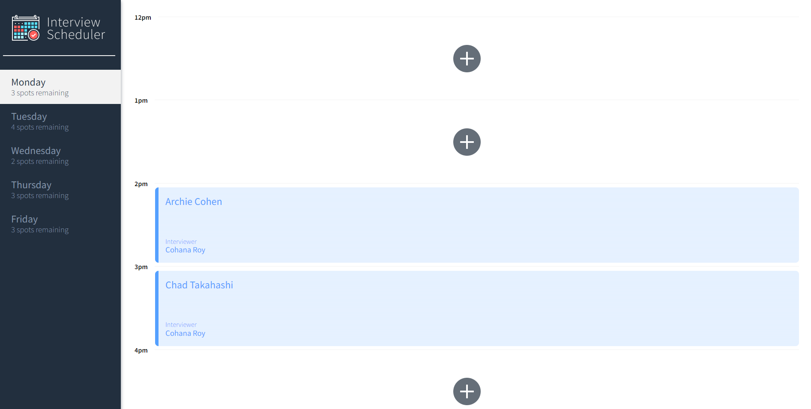
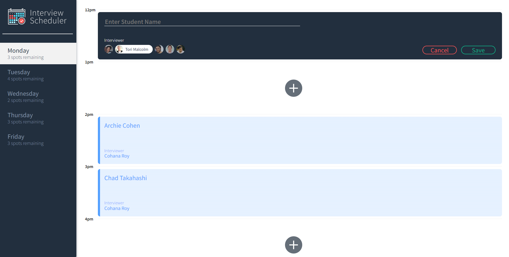
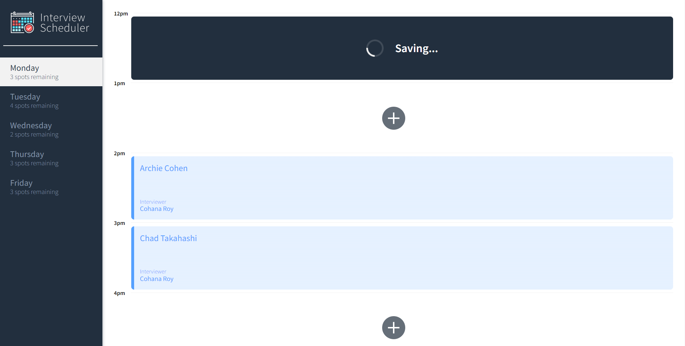
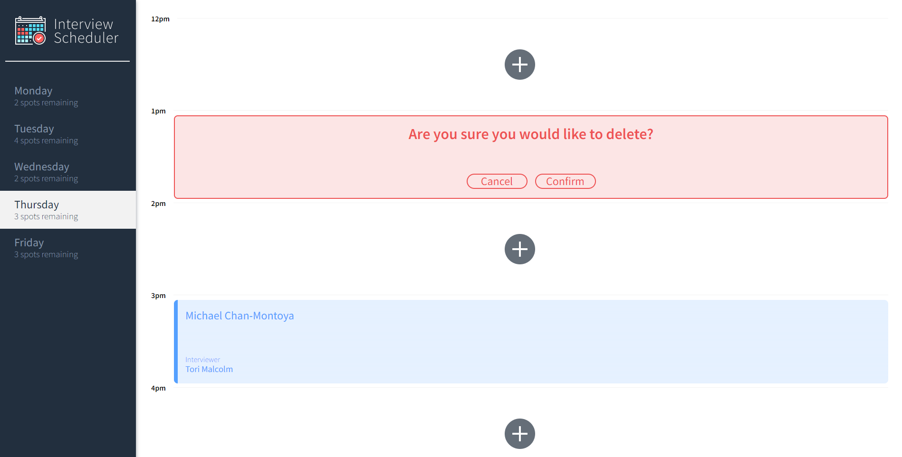
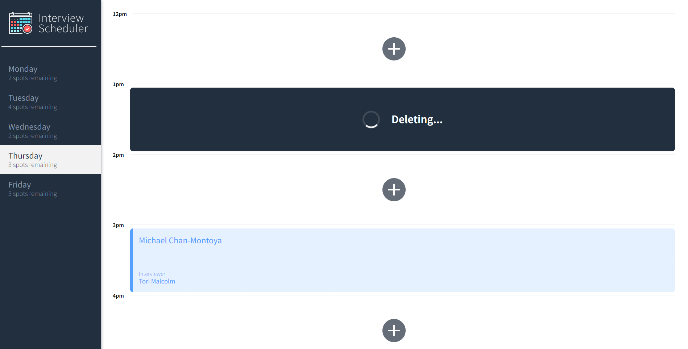

<p align="center">
  <a href="https://github.com/tangivan/scheduler">
    
  </a>

  <h3 align="center">Interview Scheduler</h3>

  <p align="center">
   Interview Scheduler is a SPA React app that allows users to easily book, edit, and cancel interviews. 
  </p>
</p>

<details open="open">
  <summary>Table of Contents</summary>
  <ul>
    <li>
      <a href="#about-the-project">About The Project</a>
      <ul>
        <li><a href="#demo-screenshots">Demo Screenshots</a></li>
      </ul>
      <ul>
        <li><a href="#dependencies">Dependencies</a></li>
      </ul>
      <ul>
        <li><a href="#development-dependencies">Development Dependencies</a></li>
      </ul>
    </li>
    <li>
    <a href="#features">Features</a>
    </li>
    <li>
    <a href="#getting-started">Getting Started</a>
    </li>
    <li>
    <a href="#testing">Testing</a>
    </li>
  </ul>
</details>

# About The Project

Interview Scheduler is a web application for users to schedule their interviews. Data is persisted by an API server using a PostgreSQL database. Core features include booking an interview, editing an interview, and canceling their interviews. Data iWebsockets have also been implemented to update all clients connected to the API server with the schedule updates. UI Components were tested with Storybook, Unit and Integration tests were done with Jest, and E2E testing was done with cypress.
<br/>

## Demo Screenshots

<p align="center">





</p>
<br />

### Dependencies

- [React](https://reactjs.org/)
- [Axios](https://github.com/axios/axios)
- [Classnames](https://www.npmjs.com/package/classnames)
- [Normalize](https://www.npmjs.com/package/normalize)

### Development Dependencies

- [Webpack](https://webpack.js.org/)
- [Babel](https://babeljs.io/)
- [Websockets](https://developer.mozilla.org/en-US/docs/Web/API/WebSockets_API)
- [Storybook](https://storybook.js.org/)
- [Webpack Dev Server](https://github.com/webpack/webpack-dev-server)
- [Jest](https://jestjs.io/en/)
- [Testing Library](https://testing-library.com/)
- [Prop-types](https://www.npmjs.com/package/prop-types)
- [Cypress](https://www.cypress.io/)
  <br/>

# Features

- Fully Responsive
- Single Page Application
- Book Interviews
- Edit Interviews
- Cancel Interviews
- Web socket connection
  <br/>

# Getting Started

1. Clone this repository onto your local device.
2. Install dependencies using the `npm install` command.
3. Set up your `.env.development` and `.env.test` files in the root of the repository with the following template:

```
REACT_APP_WEBSOCKET_URL=
PORT=
CHOKIDAR_USEPOLLING=false
```

4. Start the client using the `npm run start` command.
5. Start the api server (not from this repository) using the `npm run start` command.
6. Start the api server (not from this repository) in error mode with `npm run test` command.
   <br/>

# Testing

Testing was done with several different testing frameworks with 97.75% code coverage.

- Static testing with [Prop-types](https://www.npmjs.com/package/prop-types)
- Unit testing with [Storybook](https://storybook.js.org/)
- Unit and Integration testing with [Jest](https://jestjs.io/en/) and [Testing Library](https://testing-library.com/)
- End to end testing with [Cypress](https://www.cypress.io/)
  <br/>

## Running Jest Test Framework

```sh
npm test
```

## Running Storybook Visual Testbed

```sh
npm run storybook
```

## Running Cypress Tests

```sh
npm run cypress
```
